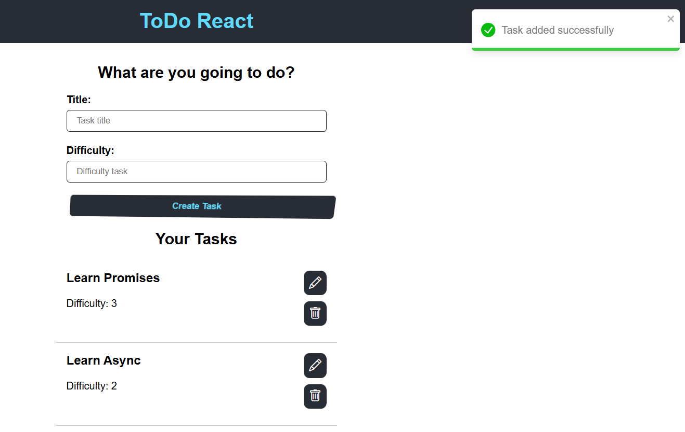

# ToDoReact
<a id="readme-top"></a>

<br />
<div align="center">

  

  <h3 align="center">ToDoReact</h3>

  <p align="center">
    This is a simple project using React with TypeScript, which allows you to create Task List.
    <br />
  </p>
</div>


## 📃 About The Project

- Show all tasks;
- Create task;
- Edit task;
- Delete task.

<p align="right">(<a href="#readme-top">back to top</a>)</p>

## 💎 Built With

* [![Node][Node]][Node-url]
* [![React][React]][React-url]
* [![Typescript][Typescript]][Typescript-url]

<p align="right">(<a href="#readme-top">back to top</a>)</p>

## ⏱️ Getting Started

This is an example of how you can run your project locally.

To get a local copy up and running follow these simple example steps.

## 🛠️ Prerequisites

* Node <br>
    [Download Node and see the documentation how to install and start](https://nodejs.org/pt)


<p align="right">(<a href="#readme-top">back to top</a>)</p>

## 🪄 Installation

1. Clone the repo
   ```sh
   git clone https://github.com/rike14/todo_react.git
   ```

<p align="right">(<a href="#readme-top">back to top</a>)</p>

## ⚙️ Commands

2. Run commands

  * npm
    ```sh
    npm install 
    ```

    *Or with yarn*

  * yarn
     ```sh
    yarn
     ```
  
  <br>

<p align="right">(<a href="#readme-top">back to top</a>)</p>

## 🏜️ Starting

3. Run command

   * npm
   ```sh
   npm run start 
   ```
   
    *Or with yarn*

   * yarn
   ```sh
   yarn start
   ```

   *The project will be run on the http://localhost:3000/*

<p align="right">(<a href="#readme-top">back to top</a>)</p>

## 🚀 Project

- [x] Home page where do you create a task and see task list:
  
  

##

- [x] Editing task:
  
  

##

- [x] Deleted task:
  
  

##

- [x] Alerts enabled:
  
  

## 🧑🏼‍💻 Author

 
 <br />
 <sub><b>Henrique M. Kronhardt</b></sub></a>
 <br />

[](https://www.linkedin.com/in/henriquekronhardt/)

---

Made with ❤️ by Henrique M. Kronhardt 👋🏽 [Get in touch!](https://www.linkedin.com/in/henriquekronhardt/)

<p align="right">(<a href="#readme-top">back to top</a>)</p>

<!-- MARKDOWN LINKS & IMAGES -->
[Node]: https://img.shields.io/badge/node.js-6DA55F?style=for-the-badge&logo=node.js&logoColor=white
[Node-url]: https://nodejs.org/pt
[React]: https://img.shields.io/badge/React-20232A?style=for-the-badge&logo=react&logoColor=61DAFB
[React-url]: https://reactjs.org/
[Typescript]: https://img.shields.io/badge/typescript-%23007ACC.svg?style=for-the-badge&logo=typescript&logoColor=white
[Typescript-url]: https://www.typescriptlang.org/